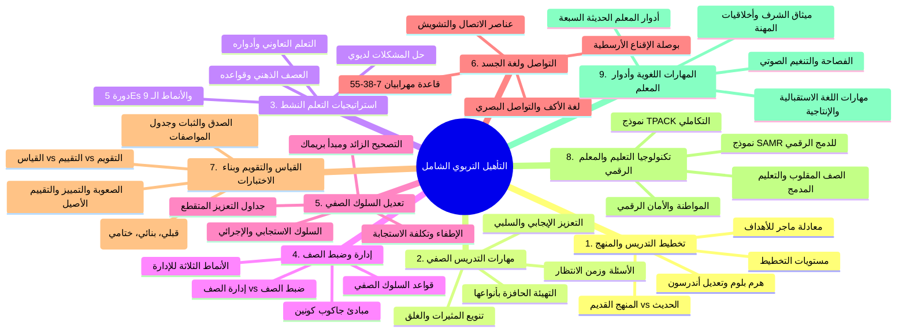

#  الحقيبة الذهبية الشاملة لاجتياز اختبار التأهيل التربوي بامتياز
### دورة إعداد وتأهيل المعلمين | كلية التربية - جامعة الإسكندرية (2026)

---

> [!IMPORTANT]
> **إلى الصديق العزيز:** هذا الدليل الشامل مصمم ليضمن لك تحصيل **أعلى درجة (امتياز)** في الامتحان بإذن الله، حتى وإن لم تفتح أياً من ملفات الدورة مسبقاً!
> تم تفريغ وتدقيق وفحص جميع الملفات الـ 19 بدقة متناهية (كلية التربية - جامعة الإسكندرية)، دون حذف أي تعريف، تصنيف، معادلة، أو فكرة علمية.
> كما تم بناء **داشبورد وتطبيق ويب تفاعلي متكامل للهاتف المحمول** يمكنك فتحه ومذاكرته وأنت في الطريق وسماعه صوتياً عبر السماعات!
>  **مسار التطبيق التفاعلي في مجلدك:** `C:\Users\user\Downloads\New folder (14)\educational_qualification_dashboard.html`

---

##  خارطة الأركان التسعة للمنهج

---

##  الركن الأول: تخطيط التدريس والمنهج المدرسي

### 1. مفهوم التخطيط وأهميته
- **تخطيط التدريس:** عملية عقلية منظمة وتصور مسبق لجميع المواقف التعليمية والأنشطة والوسائل والإجراءات وأساليب التقويم التي يتبعها المعلم لتحقيق نواتج تعلم محددة لدى الطلاب في فترة زمنية معينة.
- **أهمية التخطيط:**
  1. يجنب المعلم العشوائية، التخبط، والارتجال والتردد.
  2. يساعد في الاختيار الأمثل للاستراتيجيات والأنشطة والوسائل الملائمة لطبيعة المتعلمين والمحتوى.
  3. يضمن الاستثمار الأفضل للوقت وتوزيع الجهد التعليمي بعدالة.
  4. يوفر للمعلم مرجعاً للتقويم الذاتي المستمر وتطوير أدائه.

### 2. مستويات التخطيط للتدريس
1. **تخطيط بعيد المدى (سنوي / فصلي):** توزيع المقررات الدراسية ووحداتها على أسابيع وشهور العام الدراسي كاملاً، مع مراعاة الإجازات والامتحانات وأسابيع المراجعة.
2. **تخطيط متوسط المدى (تخطيط الوحدات):** خطة لوحدة دراسية متكاملة (Unit Plan) تستغرق أسبوعين إلى شهر، تحدد الأهداف العامة للوحدة وترابط موضوعاتها.
3. **تخطيط قصير المدى (تخطيط الدرس اليومي):** الخطة الإجرائية التفصيلية المباشرة التي ينفذها المعلم داخل الحصة الواحدة.

### 3. عناصر المنهج: القديم vs الحديث
| وجه المقارنة | المنهج التقليدي (القديم) | المنهج الحديث |
| :--- | :--- | :--- |
| **المفهوم** | مجموعة معلومات ومعارف وحقائق مجردة يحفظها الطالب. | مجموع الخبرات والأنشطة التربوية المخططة داخل المدرسة وخارجها لتعديل سلوك المتعلم ونموه الشامل. |
| **المحور والتركيز** | المادة الدراسية والكتاب المدرسي وحشو الأذهان. | المتعلم ونموه المتوازن (عقلياً، وجدانياً، مهارياً، واجتماعياً). |
| **دور المعلم** | ملقن وناقل للمعرفة ومصدر وحيد للمعلومات ومسيطر. | ميسر، موجه، مرشد، مصمم لبيئات التعلم، وباحث. |
| **دور المتعلم** | سلبي، متلقٍ ومستمع، يحفظ ويسترجع في الامتحان. | إيجابي، نشط، باحث، مكتشف، مجرب، ومقوم لأدائه. |
| **طرق التدريس** | المحاضرة، التسميع، والإلقاء التقليدي الروتيني. | التعلم النشط، حل المشكلات، الاستقصاء، والتعلم التعاوني. |
| **الأنشطة المدرسية** | مهملة وتعتبر مضيعة للوقت ومنفصلة عن المنهج. | جوهر المنهج وعنصر لا يتجزأ من الخبرة التربوية. |
| **التقويم** | مقتصر على قياس الحفظ في نهاية العام (ختامي فقط). | شامل، مستمر، ومتنوع (قبلي، تكويني، ختامي، وتقييم أصيل). |

### 4. صياغة الأهداف السلوكية (معادلة ماجر Mager)
$$\text{الهدف السلوكي} = \text{أن} + \text{فعل مضارع سلوكي قابل للملاحظة والقياس} + \text{المتعلم} + \text{محتوى التعلم} + \text{شرط الأداء} + \text{معيار الأداء المقبول}$$

- **مثال نموذجي:** (أن يحدد [فعل] الطالب [المتعلم] عواصم خمس دول عربية [محتوى] على خريطة صماء [شرط] دون أي خطأ [معيار]).

> [!CAUTION]
> **الأخطاء القاتلة في صياغة الأهداف السلوكية (مفخخات الامتحان):**
> 1. **وصف نشاط المعلم بدلاً من سلوك الطالب:** (أن يشرح المعلم درس الفاعل) [خطأ]  الصواب: (أن يستخرج الطالب الفاعل) [صحيح].
> 2. **وصف عملية التعلم بدلاً من ناتج التعلم:** (أن يتدرب التلميذ على كتابة القصة) [خطأ]  الصواب: (أن يكتب التلميذ قصة قصيرة مستوفية عناصرها) [صحيح].
> 3. **اشتمال الهدف على أكثر من ناتج مركب:** (أن يقرأ الطالب النص ويعربه ويستخرج الفاعل) [خطأ]  الصواب: فصلها في أهداف مستقلة [صحيح].
> 4. **استخدام أفعال باطنية غير قابلة للقياس المباشر:** مثل (يعرف، يفهم، يدرك، يتذوق، يستوعب، يعي، يؤمن) [خطأ]  الصواب: استخدام أفعال سلوكية ظاهرة مثل (يذكر، يفسر، يقارن، يحل، يبرهن) [صحيح].

### 5. تصنيف مجالات الأهداف التعليمية
1. **المجال المعرفي (هرم بلوم وتعديل أندرسون 2001):**
   - 1. التذكر (Remembering)  2. الفهم (Understanding)  3. التطبيق (Applying)  4. التحليل (Analyzing)  5. التقويم (Evaluating)  6. الابتكار / الإبداع (Creating) [القمة].
2. **المجال الوجداني / الانفعالي (كراثوول Krathwohl):**
   - 1. الاستقبال / الانتباه  2. الاستجابة  3. التقدير / الحكم القيمي  4. التنظيم القيمي  5. التميز بقيمة أو مركب قيمي (الوسم بالقيمة).
3. **المجال النفس حركي / المهاري (سيمبسون Simpson):**
   - 1. الإدراك الحسي  2. الميل والاستعداد  3. الاستجابة الموجهة (التقليد والمحاكاة)  4. الآلية والتعويد  5. الاستجابة الظاهرية المعقدة (الإتقان والانسيابية)  6. التكيف والتعديل  7. الأصالة والابتكار.

---

##  الركن الثاني: مهارات التدريس الصفي والتنفيذ

### 1. مهارة التهيئة الحافزة (Set Induction)
- **الفرق بين التهيئة والتمهيد:**
  - **التمهيد:** مدخل معرفي منطقي لمراجعة الدروس السابقة.
  - **التهيئة:** شحذ نفسي وتشويقي ووجداني لشد الانتباه وإثارة الدافعية والفضول نحو الجديد.
- **أنواع التهيئة الثلاثة:**
  1. **التهيئة التوجيهية:** في بداية الدرس أو الوحدة لتوجيه الانتباه وتقديم إطار عام.
  2. **التهيئة الانتقالية:** أثناء سير الدرس للانتقال السلس من فكرة منتهية إلى فكرة جديدة دون انقطاع ذهني.
  3. **التهيئة التقويمية:** لفحص وتقويم مدى استيعاب الطلاب لما تم شرحه قبل الانتقال لنقطة تعليمية جديدة.

### 2. مهارة الأسئلة الصفية وزمن الانتظار (Wait Time)
- **الخطوات الست لطرح السؤال:**
  1. الصياغة الواضحة والموجزة.
  2. إلقاء السؤال على الفصل بأكمله.
  3. التوقف وإتاحة **زمن الانتظار (3 إلى 5 ثوانٍ)**.
  4. اختيار طالب للإجابة بالاسم وبشكل عشوائي عادل.
  5. الاستماع التام دون مقاطعة متعجلة.
  6. تقديم التغذية الراجعة والتعزيز المناسب.
- **آثار زيادة زمن الانتظار (ماري باد رو Mary Budd Rowe):**
  - زيادة طول وعمق إجابات الطلاب واستدلالاتهم المنطقية.
  - ارتفاع مشاركة بطيئي التعلم والطلاب الخجولين.
  - انخفاض عبارات العجز مثل "لا أعرف" والصمت التام.
  - تحول التفاعل من خط أحادي (معلم-طالب) إلى تفاعل شبكي تعاوني بين الطلاب.

### 3. مهارة التعزيز الصفي (Reinforcement)
- **التعزيز الإيجابي:** إضافة مثير سار ومحبب (ثناء، درجات، جوائز، مسؤولية) عقب السلوك المرغوب لتقويته.
- **التعزيز السلبي:** سحب أو إزالة مثير مؤلم أو منفر (إعفاء من واجب شاق، رفع عقوبة) لمكافأة السلوك المرغوب لتقويته وزيادة تكراره.
- **الفرق الجوهري:** التعزيز دائماً (إيجابياً أو سلبياً) يهدف لـ **زيادة السلوك المرغوب**، بينما العقاب يهدف لـ **تقليل وإضعاف السلوك غير المرغوب**.

### 4. غلق الدرس (Closure)
- **الغلق الإدراكي:** تلخيص المفاهيم الأساسية وربط عناصر الدرس في بنية معرفية متماسكة.
- **الغلق النمائي:** ربط الدرس بالحياة والمستقبل والدروس اللاحقة وتكليف الطلاب بمشاريع بحثية ممتدة.

---

##  الركن الثالث: استراتيجيات التدريس والتعلم النشط

### 1. التسلسل الهرمي للمصطلحات
$$\text{المدخل التدريسي (Approach)} \longrightarrow \text{الاستراتيجية (Strategy)} \longrightarrow \text{الطريقة (Method)} \longrightarrow \text{الأسلوب (Style)} \longrightarrow \text{التكتيك (Technique)}$$

### 2. استراتيجية العصف الذهني (Brainstorming - أوزبورن)
- **القواعد الأربعة الصارمة:**
  1. **إرجاء الحكم والتقييم:** النقد مؤجل وممنوع تماماً أثناء توليد الأفكار.
  2. **إطلاق حرية التفكير والترحيب بالأفكار الجامحة:** الأفكار الخيالية تولد حلولاً ذكية.
  3. **التركيز على الكم وغزارة الأفكار:** الكمية تولد الكيف والجودة.
  4. **البناء على أفكار الآخرين:** اقتباس وتطوير ودمج أفكار الزملاء.

### 3. حل المشكلات (جون ديوي John Dewey)
1. الشعور بالمشكلة والحيرة والشك.
2. تحديد المشكلة وتوصيفها بدقة.
3. جمع البيانات والمعلومات.
4. فرض الفروض وصياغة الحلول المؤقتة.
5. اختبار صحة الفروض بالتجريب أو التحليل.
6. التوصل إلى الحل واعتماده وتطبيقه والتعميم.

### 4. التعلم التعاوني (جونسون وجونسون Johnson & Johnson)
- **الركائز الخمس:** 1. الاعتماد المتبادل الإيجابي (نغرق معاً أو ننجح معاً). 2. المسؤولية والمحاسبية الفردية. 3. التفاعل المعزز وجهاً لوجه. 4. المهارات الاجتماعية البينشخصية. 5. المعالجة والتقييم الجماعي.
- **الأدوار:** القائد/الميسر، المقرر/الكاتب، الميقاتي (ضابط الوقت)، مسؤول الأدوات، والمتحدث الرسمي.

### 5. دورة التعلم الخماسية (5Es)
$$\text{1. الانشغال (Engage)} \longrightarrow \text{2. الاستكشاف (Explore)} \longrightarrow \text{3. الشرح (Explain)} \longrightarrow \text{4. التوسيع (Elaborate)} \longrightarrow \text{5. التقويم (Evaluate)}$$

### 6. أنماط المتعلمين التسعة (وفق الدورة والإنفوجرافيك)
1. **البصري:** بالصور والخرائط والشرائح.
2. **السمعي:** بالمحاضرات والمناقشات والصوت.
3. **الحركي/الحسي:** باللمس والممارسة والتجارب.
4. **المدون (Note-Taker):** بكتابة التلخيصات وتدوين الملاحظات.
5. **المسترخي:** في بيئة هادئة خالية من التهديد والصراخ.
6. **المتعلم بالضغط:** تحت المواعيد النهائية (Deadlines) والتحديات السريعة.
7. **الناسخ:** بمحاكاة وتقليد النماذج الواقعية خطوة بخطوة.
8. **المعلم (The Teacher Learner):** بشرح وتدريس المعلومة لزملائه (تقنية فاينمان).
9. **الواثق / الموجه ذاتياً:** بالاستقلالية والبحث الذاتي وحل المشكلات بمفرده.

---

##  الركن الرابع: إدارة الصف وضبط الصف المدرسي

### 1. إدارة الصف vs ضبط الصف
- **إدارة الصف (Classroom Management):** مفهوم شامل وإيجابي واستباقي (Proactive)؛ ينظم البيئة الفيزيقية والاجتماعية والتعليمية، ويعتمد على الانضباط الذاتي الداخلي وتيسير التعلم.
- **ضبط الصف (Classroom Discipline):** مفهوم ضيق وعلاجي ورد فعلي (Reactive)؛ يركز على كبح السلوك الشاذ، فرض الهدوء، واستخدام السلطة الخارجية والإلزام.

### 2. أنماط الإدارة الصفية
1. **النمط التسلطي / الاستبدادي:** أوامر، تهديد، وعقاب. ينتج عنه خنوع وهدوء ظاهري أثناء وجود المعلم، وانفجار الفوضى والعنف بمجرد غيابه، وانعدام المبادرة.
2. **النمط الفوضوي / التسيبي:** غياب التوجيه والضوابط. ينتج عنه فوضى مستمرة، ضياع الوقت، وتدني التحصيل وتوتر الطلاب الجادين.
3. **النمط الديمقراطي / الشوري (الأمثل):** مشاركة الطلاب في وضع القواعد، احترام متبادل، حزم في غير عنف ومرونة في غير ضعف. ينتج عنه انضباط ذاتي نابع من الداخل، علاقات إيجابية، وتحصيل مرتفع ونمو التفكير الناقد.

### 3. مبادئ جاكوب كونين (Jacob Kounin) للإدارة الصفية
1. **الوعي الشامل والإحاطة (Withitness):** قدرة المعلم على إشعار الصف بأنه يرى ويعلم كل ما يجري في كل لحظة حتى وظهره لهم، والتدخل المبكر جداً.
2. **تداخل وتزامن المهام (Overlapping):** مهارة إدارة أكثر من موقف صفي في نفس اللحظة دون مقاطعة سير الدرس.
3. **السلاسة وتدفق الدرس (Smoothness & Momentum):** الانتقال المرن بين الأنشطة دون قفزات مشتتة أو توقفات بطيئة، والمحافظة على حيوية الحصة.
4. **استمرار إشراك وتنبيه الجماعة (Group Alerting):** إبقاء كل الطلاب في حالة يقظة وتفكير مستمر وليس فقط الطالب الذي يجيب.

---

##  الركن الخامس: المشكلات السلوكية وتعديل السلوك الصفي

### 1. تصنيف السلوك الإنساني
- **السلوك الاستجابي:** لا إرادي وانعكاسي تحكمه مثيرات قبلية تسبقه مباشرة (نظرية بافلوف).
- **السلوك الإجرائي:** إرادي يصدر عن المتعلم وتتحكم فيه النتائج والمعززات البعدية التي تلحقه (نظرية سكينر).

### 2. فنيات تعديل السلوك المعرفي والإجرائي
- **التعزيز المتقطع ذو النسبة المتغيرة:** أقوى جداول التعزيز وأشدها مقاومة للانطفاء والتلاشي.
- **التشكيل (Shaping):** تعزيز التقارب المتتابع للوصول لسلوك نهائي مركب وصعب.
- **التسلسل (Chaining):** ربط خطوات سلوكية متسلسلة بسيطة لتكوين أداء كلي متكامل.
- **الإطفاء / المحو (Extinction):** حجب وإيقاف المعزز (كالانتباه) الذي كان يغذي السلوك غير المرغوب حتى يتلاشى. (يرافقه ظاهرة *الانفجار الانطفائي المؤقت*).
- **تكلفة الاستجابة (Response Cost):** غرامة سلوكية تتضمن سحب جزء من المعززات أو الدرجات التي يمتلكها الطالب نتيجة مخالفته للقواعد.
- **الإقصاء عن التعزيز (Time-out):** عزل الطالب مؤقتاً في مكان محايد خالٍ من المثيرات (القاعدة: دقيقة واحدة لكل سنة من عمر الطفل).
- **التصحيح الزائد (Overcorrection):** تصحيح الوضع (إعادة المكان لأفضل مما كان عليه) + الممارسة الإيجابية المكثفة للسلوك الصحيح.
- **مبدأ بريماك (Premack Principle / قانون الجدة):** استخدام نشاط محبب ذي احتمالية عالية كمكافأة ومعزز لإنجاز نشاط غير محبب ذي احتمالية منخفضة.

---

##  الركن السادس: التواصل التربوي الفعال ولغة الجسد

### 1. عناصر الاتصال والتشويش
$$\text{المرسل (المعلم)} \longrightarrow \text{الرسالة} \longrightarrow \text{القناة / الوسيط} \longrightarrow \text{المستقبل (المتعلم)} \longrightarrow \text{التغذية الراجعة (Feedback)}$$
- **التشويش:** مادي (ضوضاء وحرارة)، نفسي (قلق وخوف)، أو دلالي (غموض الكلمات ومصطلحات غير مفهومة).

### 2. قاعدة ألبرت مهرابيان (Mehrabian 7-38-55)
في التواصل العاطفي والتعبير عن المصداقية والمشاعر:
- **55%** لغة الجسد وتعبيرات الوجه والعيون.
- **38%** نبرة الصوت وتلوينه وطبقاته وسرعته.
- **7%** فقط الكلمات والألفاظ المجردة المنطوقة بمفردها.

### 3. أسرار لغة الجسد الصفي للمعلم
- **التواصل البصري:** مسح بصري شامل لكافة أرجاء الفصل على شكل (W) أو (Z)، وتجنب التحديق المحرج.
- **الكف المفتوح للأعلى:** دعوة، صدق، ترحيب، واستحثاث للمشاركة.
- **الكف الموجه للأسفل:** سلطة، حزم، وطلب الهدوء والسكينة.
- **توجيه الإصبع السبابة للطلاب:** ممنوع تربوياً تماماً لأنه يحمل دلالة اتهام وتهديد ويدمر الألفة.
- **المسافات المكانية (إدوارد هول):** المنطقة الاجتماعية (1.2 إلى 3.6 متر) هي المسافة المثالية للتفاعل والتحرك الصفي.
- **بوصلة الإقناع الأرسطية:** Ethos (المصداقية والأخلاق)، Logos (المنطق والبرهان)، Pathos (العاطفة والمشاعر)، و Kairos (التوقيت المناسب).

---

##  الركن السابع: القياس والتقويم وبناء الاختبارات

### 1. الثلاثية الكبرى: قياس vs تقييم vs تقويم
1. **القياس (Measurement):** إعطاء قيمة عددية كمية للسمة المقاسة دون إصدار حكم (مثل: 16 من 20).
2. **التقييم (Assessment):** إصدار حكم نوعي وصفي في ضوء معيار محدد (مثل: المستوى جيد جداً).
3. **التقويم (Evaluation):** العملية الشاملة: (تشخيص نقاط القوة والضعف + إصدار حكم + وضع خطة علاج وتطوير وإثراء مستمرة).
- **القاعدة:** كل تقويم يتضمن تقييماً وقياساً، والتقويم هو الأعم والأشمل.

### 2. أنواع التقويم التربوي
- **القبلي / التشخيصي:** قبل التدريس لتحديد نقطة الانطلاق والمتطلبات السابقة وتسكين الطلاب.
- **البنائي / التكويني المستمر:** أثناء التدريس لتقديم تغذية راجعة فورية وتصحيح المسار (لا ترصد عليه درجات نهائية).
- **الختامي / التجميعي:** في نهاية الفصل/العام لإصدار أحكام النجاح والرسوب ومنح الشهادات.
- **التتبعي:** بعد التخرج لقياس استدامة أثر التعلم في الواقع وسوق العمل.

### 3. شروط أداة القياس الجيدة
- **الصدق (Validity):** أن يقيس الاختبار ما وضع لقياسه فعلاً. (صدق المحتوى ويتحقق بجدول المواصفات، الصدق الظاهري، الصدق المرتبط بمحك تلازمي وتنبؤي، وصدق البناء).
- **الثبات (Reliability):** دقة واستقرار واتساق النتائج إذا أعيد تطبيقه على نفس الأفراد. (يحسب بـ: إعادة الاختبار، الصور المتكافئة، التجزئة النصفية لسبيرمان براون، ألفا كرونباخ، وكودر ريتشاردسون KR-20/21).
- **العلاقة الحتمية:** **كل اختبار صادق هو اختبار ثابت بالضرورة حتماً. ولكن ليس كل اختبار ثابت صادقاً!** (الثبات شرط ضروري للصدق ولكنه غير كافٍ بمفرده).
- **الموضوعية:** عدم تأثر الدرجة بذاتية المصحح أو اختلاف المصححين.

### 4. جدول المواصفات والمعادلات الإحصائية
$$\text{الوزن النسبي للموضوع} = \frac{\text{ساعات تدريس الموضوع}}{\text{إجمالي ساعات المادة}} \times 100\%$$
$$\text{عدد أسئلة الخلية} = \text{إجمالي أسئلة الاختبار} \times \text{الوزن النسبي للموضوع} \times \text{الوزن النسبي لمستوى الهدف}$$

- **معامل الصعوبة ($P$):** نسبة المجيبين صح $P = \frac{R}{N}$ (المدى المقبول تربوياً: من 0.30 إلى 0.70، والأمثل 0.50).
- **معامل التمييز ($D$):** $D = \frac{R_U - R_L}{n}$ (أكثر من 0.40 ممتاز، أقل من 0.20 ضعيف يحذف، القيمة السالبة تعني خطأ كارثياً يلغى فوراً).
- **المشتت الفعال:** هو البديل الخاطئ الذي يجذب طلاب الفئة الدنيا الضعيفة أكثر من طلاب الفئة العليا.

### 5. أدوات التقييم الأصيل والبديل
- **ملف الإنجاز (Portfolio):** تجميع هادف وتراكمي لأعمال الطالب ومسوداته وتأملاته الذاتية لتوثيق نموه عبر الزمن.
- **سلالم التقدير اللفظية (Rubrics):** دليل تقييم متدرج يصف مستويات الأداء (تحليلي: لكل معيار على حدة، وكلي: تقييم عام شامل للمهمة ككل).
- **قوائم الشطب (Checklists):** أداة ثنائية بسيطة ترصد تحقق السلوك أو غيابه (نعم/لا).

---

##  الركن الثامن: تكنولوجيا التعليم والمعلم الرقمي ومهارات العصر (د. نجوان حامد القباني)

### 1. مفهوم تكنولوجيا التعليم واشتقاقها ومعادلة المهارة
- **الاشتقاق اللغوي:** كلمة إغريقية يونانية مركبة من:
  - **Techno:** وتعني الفن، الحرفة، الصنعة، الأداء أو التطبيق العملي.
  - **Logy:** وتعني العلم، الدراسة المنظمة، أو النظرية.
  - **المعنى الكلي:** **علم الأداء أو علم التطبيق** (Science of Performance / Application).
- **تعريف تكنولوجيا التعليم المعتمد (AECT):** "النظرية والتطبيق في **تصميم، وإنتاج، واستخدام، وتقويم، وإدارة** العمليات والمصادر من أجل التعلم".
- **مفهوم المهارة:** التمكن من إنجاز مهمة معينة بكيفية محددة وبدقة متناهية وسرعة ملحوظة في التنفيذ واقتصاد في الجهد والتكلفة.
- **معادلة المهارة الذهبية:**
  $$\text{المهارة} = \text{الجانب المعرفي (الإدراك والنظرية)} + \text{الجانب الأدائي (الممارسة والتطبيق العملي)}$$
- **مهارات تكنولوجيا التعليم للمعلم:** معارف وقدرات وأداءات عملية يمتلكها المعلم ويستعين بها في تخطيط المواقف التعليمية وتنفيذها وتقويمها تصميماً وإنتاجاً واستخداماً وتقويماً وإدارةً.

### 2. تصنيف مهارات تكنولوجيا التعليم ومبرراتها المعاصرة
- **تصنيف مكتب التربية العربي لدول الخليج (ABEGS) - 6 كفايات كبرى:**
  1. **التحليل (Analysis):** تحليل خصائص المتعلمين واحتياجاتهم وتحليل المحتوى والبيئة.
  2. **التصميم (Design):** صياغة الأهداف الرقمية وتصميم سيناريوهات الدروس التفاعلية.
  3. **الإنتاج (Production):** إنتاج الوسائط المتعددة (صور، فيديو، صوت، رسوم تفاعلية).
  4. **الاستخدام (Utilization):** التوظيف الصفي والافتراضي للوسائل الرقمية وفق طرائق التعلم النشط.
  5. **الإدارة (Management):** إدارة الصف الرقمي والفصول الافتراضية ومصادر التعلم والبيانات.
  6. **التقويم (Evaluation):** بناء الاختبارات الإلكترونية وتحليل النتائج وتقديم التغذية الراجعة الفورية.
- **مجالات المعلم الأربعة:** تصميم الدروس، إنتاج الوسائط المتعددة، استراتيجيات التدريس الرقمي، وتقويم تعلم الطلاب.
- **مبررات ودواعي مهارات تكنولوجيا التعليم:**
  1. الثورة المعرفية والانفجار المعرفي المتسارع.
  2. الثورة التكنولوجية وتطور الأجهزة والمنصات الذكية.
  3. ثورة الاتصالات والشبكات والتدفق اللحظي للمعلومات.
  4. الانفجار السكاني وتزايد أعداد الطلاب والحاجة لتفريد التعلم.
  5. تغير فلسفة إعداد المعلم من ملقن إلى ميسر ومصمم بيئات تعليمية.

### 3. مهارات القرن الحادي والعشرين (21st Century Skills)
- **مهارات التعلم والإبداع (4Cs):** التفكير الناقد وحل المشكلات، التواصل الفعال، التشارك والعمل الجماعي، والإبداع والابتكار.
- **مهارات الثقافة الرقمية والإعلامية:** الثقافة المعلوماتية (Information Literacy)، الثقافة الإعلامية (Media Literacy)، والثقافة الرقمية والتكنولوجية (ICT Literacy).
- **مهارات الحياة والمهنة:** المرونة والتكيف، المبادرة والتعلم الذاتي، الإنتاجية والمساءلة، والقيادة وتحمل المسؤولية.

### 4. المهارات الرقمية التسع الأساسية لمعلم القرن 21 وأدواتها التطبيقية
| المهارة الرقمية الأساسية | التطبيقات والأدوات الرقمية المعتمدة | التطبيق التربوي الصفي |
| :--- | :--- | :--- |
| **1. تسجيل وتحرير المقاطع الصوتية** | SoundCloud, Audioboom, Vocaroo, Clyp.it | تسجيل الشروح الصوتية الموجزة ومخارج الحروف والقصص المسموعة. |
| **2. تصميم وإنتاج الفيديو التعليمي** | Wevideo, Magisto, Animoto, YouTube Editor | شروح التجارب العلمية والمفاهيم التجريدية للصف المقلوب. |
| **3. تصميم الملصقات والرسوم البيانية** | Canva, Piktochart, Drawings.google, Thinglink | تلخيص الدروس في صور إنفوجرافيك تفاعلية وملصقات حائطية. |
| **4. إعداد العروض التقديمية التفاعلية** | Google Slides, Haikudeck, Prezi, Zoho Show | تقديم الأفكار بتسلسل بصري تفاعلي ديناميكي. |
| **5. استخدام المدونات والويكي** | Blogger, WordPress, Edublogs, Wikispaces | النشر المعرفي والمشروعات الجماعية والتوثيق التعاوني للطلاب. |
| **6. التفاعل عبر الشبكات المهنية** | Twitter / X, LinkedIn, Facebook, Groups | التطوير المهني المستمر وتبادل الخبرات مع المعلمين عالمياً. |
| **7. إنشاء الاختبارات والمسابقات** | Testmoz, Quizalize, Flipquiz, Riddle | التقييم التكويني السريع والألعاب التنافسية والتغذية الفورية. |
| **8. تنظيم ومشاركة المصادر والمراجع** | Diigo, Scoop.it, Educlipper, Edshelf | تصنيف الروابط والمقالات في مكتبة سحابية مشتركة للمقرر. |
| **9. إنشاء ملفات الإنجاز (E-Portfolio)** | Seesaw, Sites.google, Weebly, Silk.co | توثيق تراكمي لأعمال ومشروعات وتأملات الطلاب الذاتية. |

### 5. عناصر المحتوى الرقمي ومعايير تصميمه (التربوية والفنية)
- **عناصر المحتوى الرقمي الستة:** الأهداف والاختبارات + المادة العلمية + الوسائط المتعددة + التفاعل والاتصال + الاستراتيجيات التدريسية + الأنشطة والتكليفات.
- **أشكال المحتوى البصري الرقمي:** مقاطع الفيديو، الصور الثابتة، الإنفوجرافيك، لقطات الشاشة (Screenshots)، العروض التقديمية، والصور المتحركة (GIFs).
- **المعايير التربوية:** وضوح الأهداف السلوكية، مقدمة شاملة، تجزئة المحتوى لوحدات قصيرة منسقة (Micro-learning)، ارتباط الوسائط بالأهداف دون حشو، معلومات المعلم للتغذية الراجعة، وعرض المراجع والمصادر العلمية الموثقة.
- **المعايير الفنية البصرية:**
  - **اللون والتضاد (Contrast):** تباين قوي بين لون النص والخلفية، ومنع وضع أصفر على أبيض لضعف مقروئيته.
  - **الخلفية الهادئة:** خلفية محايدة بسيطة وتجنب الصور المزدحمة تحت النصوص.
  - **تصميم النص:** الاعتماد على النقاط المركزة (Bullet points)، تجنب كتل الفقرات الطويلة وقراءة النص، وتجنب خطوط WordArt والظلال الزائدة.
  - **الصور والرسوم (التناسب والاتزان):** تجنب الازدحام البصري (Visual Clutter)، قاعدة الإيجاز 6×6 (6 أسطر، 6 كلمات بالسطر)، وتوزيع العناصر بتوازن يريح العين.

### 6. تطبيقات الذكاء الاصطناعي الحديثة في التعليم
- **Google NotebookLM:** استوديو البحث والإنشاء بالذكاء الاصطناعي (AI Research & Creation Studio)؛ يحلل مختلف التنسيقات (PDF, Docs, YouTube)، يولد خرائط مفاهيم بصرية (Mind Maps)، ينشئ ملخصات صوتية وبودكاست تفاعلي (Audio Overviews)، ويولد اختبارات وبطاقات استذكار فورية.
- **Magic School AI:** ملقبة بـ **"السكين السويسري للمعلم" (The Swiss Army Knife for Teachers)**؛ تضم أكثر من 60 أداة متخصصة لتخطيط الدروس، صياغة أسئلة بلوم، إعداد أوراق عمل متمايزة، وتفريد التعليم.
- **GAMMA (Gamma App):** منصة لإنشاء العروض التقديمية والوثائق والمواقع التفاعلية بنقرة واحدة عبر أوامر نصية موجزة وبإخراج بصري فائق.
- **Napkin AI:** أداة لتحويل النصوص والقوائم آلياً إلى مخططات ورسوم بصرية توضيحية وشبكات مفاهيمية (Diagrams) تعزز الفهم البصري.

### 7. النماذج العالمية لدمج التكنولوجيا (TPACK & SAMR)
- **نموذج تيباك (TPACK):** التكامل الثلاثي بين معرفة المحتوى (CK)، المعرفة البيداغوجية (PK)، والمعرفة التكنولوجية (TK).
- **نموذج سامر (SAMR):** 1. الاستبدال (Substitution) -> 2. الزيادة (Augmentation) -> 3. التعديل (Modification) -> 4. إعادة التعريف (Redefinition).
- **استراتيجيات حديثة:** الصف المقلوب (Flipped Classroom)، التعليم المدمج (Blended Learning)، والمواطنة الرقمية وأخلاقيات الفضاء السيبراني.

---

##  الركن التاسع: المهارات اللغوية للمعلم وأدواره المهنية

### 1. مهارات اللغة الأربع
- **مهارات استقبالية:** الاستماع (الإنصات الواعي وفهم المسموع)، والقراءة (الفهم والنقد والقراءة الجهرية السليمة).
- **مهارات إنتاجية:** التحدث (الفصاحة، التنغيم، وتجنب اللحن)، والكتابة (السلامة الإملائية، علامات الترقيم، ووضوح الخط).
- **مواصفات لغة المعلم:** الفصحى الميسرة، التلوين الصوتي الدلالي، ومطابقة الكلام لمقتضى الحال وأعمار الطلاب.

### 2. أدوار المعلم الحديثة السبعة
1. ميسر ومسهل للتعلم (Facilitator).
2. مصمم للبيئات والخبرات التعليمية (Instructional Designer).
3. باحث إجرائي (Action Researcher) يحل مشكلات صفه بالبحث العلمي المباشر.
4. مرشد وموجه نفسي وأكاديمي (Mentor).
5. قائد ومدير صفي قدير (Classroom Leader).
6. مقوم ومطور مستمر للتعلم (Evaluator).
7. شريك مجتمعي وسفير للقيم الإنسانية (Community Partner).

### 3. ميثاق الشرف وأخلاقيات المهنة
القدوة الحسنة، العدالة والإنصاف دون تمييز، الأمانة العلمية، **كتمان أسرار الطلاب وظروفهم الخاصة**، والتنمية المهنية المستمرة.

---

##  كيفية استخدام الداشبورد التفاعلي على الهاتف المحمول وأنت في الطريق:

1. افتح المجلد: `C:\Users\user\Downloads\New folder (14)` على حاسوبك.
2. ستجد الملف التفاعلي المولد باسم: `educational_qualification_dashboard.html`.
3. يمكنك نقله لهاتفك المحمول مباشرة عبر (WhatsApp Web، Telegram، كابل USB، أو Google Drive).
4. **ميزات الداشبورد على هاتفك:**
   - يعمل بالكامل **أوفلاين بدون إنترنت**.
   - شريط تنقل سفلي بإصبع الإبهام (محتوى، فلاش كاردز، محاكي 50 سؤالاً، مفخخات الامتحان، بحث فوري).
   - زر **القراءة الصوتية ()**: ضع السماعات في أذنيك وأنت في الطريق، وسيقوم التطبيق بقراءة الموديولات لك صوتياً!
   - وضع ليلي / نهاري للقراءة المريحة تحت أشعة الشمس أو في الظلام.
   - حفظ تلقائي للتقدم والأسئلة والكروت التي أتقنتها على ذاكرة الهاتف.

بالتوفيق الكامل يا صديقي، وأعلى الدرجات بإذن الله تعالى! 

---

## الملحق التكميلي الشامل: أدوات جمع البيانات غير الاختبارية والتدقيق الأكاديمي النهائي (100% Zero Omission)

### 1. أدوات جمع البيانات غير الاختبارية في التقويم التربوي (أ.د/ حسن سعد عابدين)
تُستخدم هذه الأدوات كبديل وركيزة أساسية عندما تعجز الاختبارات التحصيلية المعرفية عن قياس المهارات الأدائية الحركية، والجوانب الوجدانية والانفعالية، والسمات الشخصية، والمهارات الاجتماعية.

#### أ. الملاحظة العلمية (Observation):
- **شروط الملاحظة العلمية الأربعة:**
  1. **الانتباه:** حالة تأهب عقلي ويقظة وتركيز، ولا يمكن الانتباه لمثيرين متساويين في القوة في نفس الوقت دون تشتت.
  2. **الإحساس:** التقاط المثيرات عبر الحواس (أهمها السمع والبصر حيث تمثلان أكثر من 95% من المعلومات الملاحظة).
  3. **الإدراك:** عملية نفسية عقلية للربط بين الإحساس الحالي والخبرات السابقة لإعطاء معنى ودلالة للسلوك.
  4. **التصور الذهني:** قدرة الملاحظ على استحضار صور وتفسيرات للمواقف الغامضة لتفسير السلوك وتقديم حلول عند غياب الخبرة المباشرة.
- **تصنيفات وأنواع الملاحظة:**
  - **من حيث الضبط:** مقيدة (منظمة وموجهة نحو أبعاد وسمات محددة مسبقاً) مقابل حرة (عفوية وغير مقيدة لتسجيل كل ما يطرأ).
  - **من حيث الزمن:** دورية (منتظمة في مواعيد محددة متكررة) مقابل عابرة (ملاحظة طارئة لموقف عارض).
  - **من حيث علاقة الملاحظ بالمفحوص:** مباشرة (وجهاً لوجه بحضور الملاحظ) مقابل غير مباشرة (من وراء زجاج عاكس أحادي الاتجاه أو عبر تسجيلات الفيديو دون علم المفحوص لضمان عدم تصنعه).
  - **من حيث الدور:** بالمشاركة (ينخرط الملاحظ في النشاط كعضو) مقابل بدون مشاركة (مراقب خارجي محايد).
- **أدوات تسجيل الملاحظة:**
  1. **السجل القصصي (Anecdotal Record):** وصف سردي قصير وموضوعي يدون فيه المعلم بدقة حدثاً سلوكياً معيناً للطالب والسياق الذي حدث فيه مباشرة دون إصدار أحكام مسبقة.
  2. **قوائم الرصد / الشطب (Checklists):** بطاقات تحتوي على قائمة من السلوكيات، وتعتمد على تقدير ثنائي فقط (نعم/لا، تحقق/لم يتحقق، مرضي/غير مرضي) دون تحديد درجة الإتقان.
  3. **سلالم التقدير (Rating Scales):** تحدد وجود السلوك ودرجة إتقانه؛ وتكون إما سلم تقدير عددي (مثل 1 إلى 5) أو سلم تقدير لفظي (ممتاز، جيد جداً، جيد، مقبول، ضعيف).

#### ب. المقابلة العلمية (Interview):
- **مفهومها وأهميتها:** تفاعل لفظي هادف وموجه بين الفاحص والمفحوص لجمع بيانات أو استثارة اتجاهات ومشاعر.
- **ميزتها الفريدة:** الأداة الوحيدة الصالحة لجمع البيانات من الأميين والأطفال الصغار وذوي الإعاقة، وتتيح ملاحظة لغة الجسد وتعبيرات الوجه ونبرات الصوت وتوضيح الغموض فورياً.
- **أنواعها:** تشخيصية (لتحديد جذور المشكلة)، علاجية (كجلسات الإرشاد النفسي)، ومسحية (في البحوث الميدانية). وتكون مقننة (أسئلة موحدة محددة سلفاً) أو حرة غير مقيدة.

#### ج. الاستبيان (Questionnaire) والمقارنة الحاسمة مع الاستفتاء:
- **مخترع الاستبيان:** العالم البريطاني **فرانسيس جالتون (Francis Galton)** (1822-1911م).
- **الفروق الجوهرية الحاسمة بين الاستفتاء والاستبيان (سؤال امتحان متكرر):**
  1. **طبيعة الموضوع:** الاستفتاء يتناول موضوعات وقضايا عامة وسياسية وانتخابات، بينما الاستبيان يتناول قضايا بحثية وأكاديمية لقياس ميول واتجاهات.
  2. **بدائل الاستجابة:** الاستفتاء خياراته ثنائية محددة فقط (نعم/لا، موافق/غير موافق)، بينما الاستبيان خياراته متعددة ومتدرجة (3 خيارات على الأقل مثل: دائماً، أحياناً، نادراً، أو مقياس ليكرت).
  3. **حجم العينة:** الاستفتاء يطبق على عينات جماهيرية ضخمة جداً، بينما الاستبيان يطبق على عينة بحثية محددة ومختارة بعناية.
- **أشكال الاستبيان:** المغلق (سهل التطبيق والتفريغ الإحصائي)، المفتوح (يتيح حرية واستفاضة في الأسباب لكنه صعب التحليل)، المغلق-المفتوح (مزدوج يجمع الميزتين).

---

### 2. تنظيم البيئة المادية وحركة المقاعد في إدارة الفصل
- **نمط الصفوف والأعمدة التقليدي:** الأنسب لإلقاء المحاضرات والشرح العام والامتحانات التحريرية، يوفر المساحة لكنه يقلل التفاعل بين الطلاب ويخلق منطقة خمول في الصفوف الخلفية.
- **نمط حدوة الفرس (U-Shape):** يحقق تواصلاً بصرياً كاملاً (Eye Contact) بين المعلم وجميع الطلاب، ويسهل تحرك المعلم للمركز، وهو الأمثل للمناقشات وعروض الوسائط.
- **نمط المجموعات الدائرية / العنقودية (Cluster Style):** الأمثل للتعلم التعاوني وحل المشكلات وورش العمل وتوزيع الأدوار، ولكنه يتطلب ضبطاً حازماً للضوضاء.

---

### 3. التعلم بالاكتشاف لجيروم برونر (Jerome Bruner)
- **الاكتشاف الموجه (Guided):** يزود المعلم الطلاب بالمشكلة مصحوبة بخطوات وتوجيهات تفصيلية للحل (الأنسب للمبتدئين وللمفاهيم المعقدة).
- **الاكتشاف شبه الموجه (Semi-guided):** يقدم المعلم المشكلة وتوجيهات عامة فقط، ويترك للطلاب حرية استنباط العلاقات.
- **الاكتشاف الحر (Free Discovery):** يواجه الطالب المشكلة دون أي توجيه ليصوغ الفروض ويجري التجارب ويستنتج الحلول باستقلالية كاملة (للمتفوقين).

---

### 4. فنيات تعديل السلوك الصفي المتقدمة
- **الاقتصاد الرمزي (Token Economy):** منح رموز فورية (فيشات، نقاط، نجوم) فور حدوث السلوك المرغوب واستبدالها لاحقاً بمعززات مساندة مادية أو نشاطية.
- **تكلفة الاستجابة (Response Cost):** سحب قدر من النقاط أو الامتيازات عند ارتكاب سلوك غير مرغوب فيه (عقاب سلبي).
- **مبدأ بريماك (Premack Principle / قاعدة الجدة):** استخدام السلوك عالي الاحتمال (النشاط المفضل والمحبب كالرسم أو اللعب) كمعزز ومكافأة لأداء السلوك منخفض الاحتمال (المهمة الدراسية أولاً).

---

### 5. مستويات الاستماع والفروق الإملائية الحاسمة للمعلم
- **مستويات الاستماع:** 
  1. السماع (Physiological Hearing): عملية فسيولوجية لا إرادية بحاسة الأذن دون تركيز.
  2. الاستماع (Listening): عملية إرادية مقصودة تتطلب الانتباه لإدراك المعنى الظاهري.
  3. الإنصات (Attentive Listening): أرقى المستويات؛ تدبر وتفاعل وجداني وتركيز عميق لما وراء الكلمات ومقاصد المتحدث.
- **همزة الوصل والقطع:**
  - همزة الوصل (ا): تثبت نطقاً في أول الكلام وتسقط في وصله (الـ التعريف، الأسماء العشرة، أمر الثلاثي، ماضي وأمر ومصدر الخماسي والسداسي).
  - همزة القطع (أ/إ): تنطق وتكتب دائماً (ماضي ومصدر الثلاثي المهموز، ماضي وأمر ومصدر الرباعي، جميع الأسماء والحروف عدا ما استثني).
- **التاء المربوطة vs التاء المفتوحة vs الهاء:**
  - التاء المربوطة (ـة/ة): تنطق تاء عند الوصل وهاء عند الوقف (مدرسةُ/مدرسةْ).
  - التاء المفتوحة (ت): تنطق تاء في الوصل والوقف (معلماتُ/معلماتْ).
  - الهاء (ـه/ه): تنطق هاء في الوصل والوقف (كتابُه الجديد/كتابُهْ).
